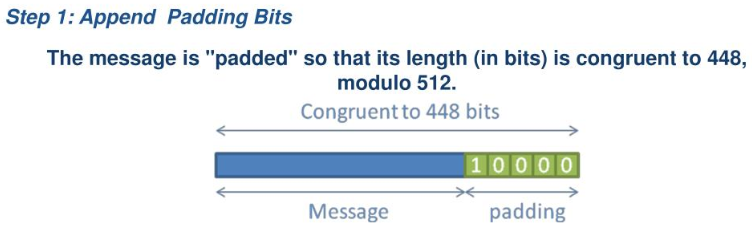
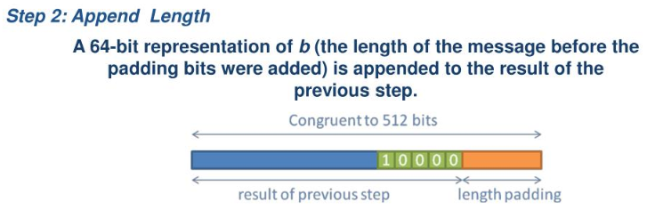
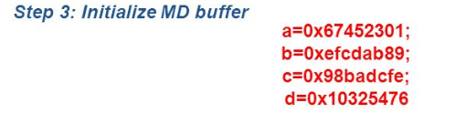
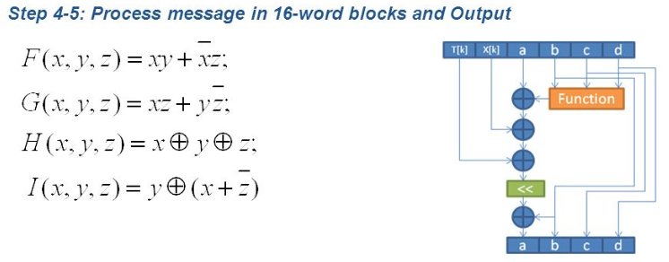
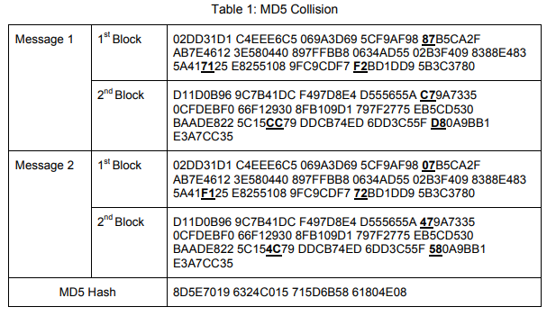

# Introduction
This repository contains the submission for my 4th year Bs.c Computing in Software Development module in GMIT, <b>Theory of Algorithms</b>. This module provides an introduction to the theory of algorithms, especially the areas of computation and computability. Students will also learn practical skills in the development of software using a selection of programming paradigms.

<br>

The following are the defined learning outcomes on completion of this module:

1. Compare different models of computation.

2. Write computer programs using a selection of programming paradigms.

3. Analyse the complexity of an algorithm.

4. Identify difficult computational problems in everyday programming.

## About the Repository
The contents of this repository was developed from the beginning of January to the end of April 2020. The main files that relate to the project specification for this module can be found in the <i>theory-of-algorithms-project</i> folder. The other folders contain code that was developed over the course of the module through a series of video/lab lectures that had been prepared for us by our lecturer for this module. The code that is contained in this repository was mainly developed using the <i>vi text editor</i> on a <i>Debian virtual machine</i> that was hosted by <i>Google cloud platform</i>. Any work done on my own machine was developed using <i>visual studio code</i> in conjunction with the <i>Windows sub-system for Linux</i> that used <i>Ubuntu 18.04</i>. 

<br>

The following is a brief description of the other folders in this repository that do not relate to the main project for this module:

* <b>hello-programs:</b>

The hello-programs folder contains two hello world programs, one written in C and the other in python. This was done as part of an introduction to this module where our lecturer took us through the steps to set up a virtual machine using the Google cloud platform. The virtual machine ran using a Debian OS image and after installing the necessary libraries needed to execute C and python programs these files were developed. 

* <b>c-bit-operations:</b>

The c-bit-operations folder contains C program files that were developed as part of the video lectures series. The purpose of these lectures was to further our understanding of how data is represented and manipulated the bit level using C. These videos were of great help in the lead up to the development of the main project for this module.

* <b>sha256:</b>

The sha256 folder contains code written in C that was developed over the last few videos in the series as a side project where we developed the sha256 hashing algorithm. In the README.md for this repository a link is provided to the main source used in the development of this algorithm along with some example testing output presented to show the reader the contents of a file after it has been processed by the program and comparing it with the output of openssl's version of the sha256 algorithm.  


## The Main Project 

The main project for the Theory of Algorithms module was to write a program in C to perform the MD5 message-digest algorithm. The main source used to develop this algorithm is specified in the [Request For Comments 1321 document supplied by the Internet Engineering Task Force.](https://tools.ietf.org/html/rfc1321)

The code developed to implement the MD5 message-digest algorithm for this project can be found in the <i>theory-of-algorithms-project</i> folder. The description of the algorithm and steps that are involved to successfully implement the MD5 message-digest algorithm are explained in the README.md file of this repository. The following will be a breakdown of the files contained within the project folder:

* <b>md5.h:</b>

The md5.h file of this folder is a header file that contains all the constants, pre-processor macro functions, global variables and function definitions for the md5.c file. Header files are commonly used when writing C programs which is evident when including files such as <b>stdio.h</b> or <b>stdlib.h</b>. In doing this you can leave the file in which your main function resides a lot more neat and tidy, another advantage in doing this is that by declaring global variables in this file your main program can use them throughout the program whereas otherwise these variables would have to be first defined in your main function.

* <b>md5.c:</b>

The md5.c file contains the logic and function implementations that went into successfully writing the MD5 message-digest algorithm. The program takes command line arguments on execution of the program and depending on the argument performs a different operation which will be explained in the next section. On execution of the program the user will have the option to either perform the MD5 algorithm on either a string input or a file path that is entered from a command line prompt. The md5.c file along with the functions written to perform the MD5 algorithm also contains testcase functions that were developed using the [cmocka](https://api.cmocka.org/) unit testing framework for C. This framework will be detailed further in the following sections.

* <b>empty:</b>

This an empty file that was created when testing the algorithm. When performing the MD5 operation on an input the empty string or file in this case is still considered a valid input and can be used as a good benchmark to assert your algorithm is correct.

* <b>inputText.txt:</b>

This file is used as part of the program when the user chooses to input a string. The program takes the user input writes it to this file and then proceeds to read the file contents as binary data and then perform the MD5 algorithm to output the correct hash value for a given input.

* <b>rfc-test2 - 7.txt</b>

The rfc-test files ranging from 2 to 7 contain the string inputs defined in the [Request For Comments 1321 document supplied by the Internet Engineering Task Force](https://tools.ietf.org/html/rfc1321) web page. These input values are listed as part of a test suite with their corresponding output values to test against for your implementation of the MD5 algorithm and check whether it is correct. The rfc-test1 is omitted as the first test is an empty string and this is handled by the empty file defined above.


# Running the Program

In this section of this document I will go over the updated steps in running this program since adding a unit testing framework to the project. As previously stated the development of this project was mainly done in a Linux environment with some local work done using Windows sub-system for Linux. So in the interests of both parties I will go over the installation of Windows sub-system for Linux and once this is complete go over the instructions of installing the C compiler along with the instructions for installing the cmocka unit testing framework. If you are already operating in a Linux environment feel free to skip ahead.

## Windows sub-system for Linux

If you would like to follow Microsofts instructions for installation, [follow this link](https://docs.microsoft.com/en-us/windows/wsl/install-win10). Otherwise continue as instructed.

Before installation you must ensure the optional feature is enabled:

1. Open Windows Poweshell as administrator and run this command

```
Enable-WindowsOptionalFeature -Online -FeatureName Microsoft-Windows-Subsystem-Linux
```

2. Restart computer when prompted.

<br>

If both previous steps were successful the next step is to download your Linux distro. The Linux system used for the development of this project was Ubuntu 18.04.

If you are happy to use the same system as was used for this project then [click this link](https://aka.ms/wsl-ubuntu-1804) and Ubuntu 18.04 will begin downloading.

If you would like to install a different Linux distro then [click this link](https://docs.microsoft.com/en-us/windows/wsl/install-manual) where you will have a list of Linux distros to choose from.

Assuming your download was successful and your Linux distro is present in your Downloads folder open Windows Powershell again and navigate to the download location.

Assuming you are in the correct folder location using Windows Powershell that contains your downloaded Linux distro, Run the following command to install your version on Linux on your Windows 10 machine.

```
Note: Replace app_name with the name of your downloaded Linux version

Add-AppxPackage .\app_name.appx
```

If all previous steps have been successfully followed then your version should be installed. The next step is to initialize your distro and set up some security features. The following steps will get you up and running with your version of Liux:

1. Open search menu on Windows task bar and search for your Linux distro name

2. Optional: Right click your distro and pin to your task bar for easy access.

3. Click your Linux distro and start it up

After this your Linux distro will need a few minutes to initialize and then you will be required to enter a name and password. Assuming that all went well then Congratulations you have access to both Windows and Linux on the one system.

## Installing the C compiler

The next steps involve installing the C compiler. These steps will now work whether you are on a Linux machine or using the Windows sub-system for Linux. From the Linux shell run the following commands:

Run the following command to be sure your file system is up to date

```
sudo apt-get update
```

Then run this command to install all essential toolchains required to run C programs

```
sudo apt-get install build-essential
```

Finally run the following command to confirm no errors are raised and the installation was successful  

```
gcc --version
```

## Installing cmocka

Since the updated version of the project spec was released, we were required to write some tests for the MD5 message-digest algorithm implemented using C. We were free to choose how we went about testing our code and I choose to use the cmocka testing framework. The md5.c file contains all the required imports to use use cmocka so to run the code you will need to install it.

To install cmocka run the following commands from the Linux shell:

If you wish to install the cmocka documentation then run this command:

```
sudo apt-get install cmocka-doc
```

To install the cmocka development files run the following command:

```
sudo apt-get install libcmocka-dev
```

Assuming you have entered these two commands, then cmocka should be installed and ready to use in your C programs.

If you would like to learn more about cmocka, then you can [follow this link](https://www.youtube.com/watch?v=GYBtduwyhaM) to a talk from DevConf 2020 where the speaker dives into it's features.

Alternatively you can [follow this link](https://www.samba.org/~asn/sambaxp_2018_andreas_schneider_cmocka.pdf) if you wish to read the slides presented at that conference.

## Cloning the Repository

To clone this repository you will need the Git software installed on your machine. To install Git on your machine [follow this link](https://git-scm.com/) and follow the installation instructions. Assuming you have the Git software installed, open a terminal window and navigate to a location where you would like this repository to be cloned. Once at this location enter the following command in the terminal.

```
git clone https://github.com/arronHealy/Theory-of-Algorithms.git
```

Once the repository is cloned move into the project folder with the following command.

```
Note: If using Windows sub-system for Linux you must mount to your C drive to access local file system by entering:

cd /mnt/c/go-to-location-of-cloned-repository

and then enter:

cd Theory-of-Algorithms/theory-of-algorithms-project
```

## Compiling and Running the Program

To run the C code in the project repository has changed since the addition of cmocka. To run this code now the following command must be entered assuming all previous installation steps have been followed and you are in the project folder:

The following command compiles your C program and the -l command links the comcka files needed to compile and test the code.

```
gcc -o md5 md5.c -l cmocka
```

There should have been no errors and now in the project folder there should now be an md5 executable file. To run this file the program takes command line arguments, to view the list of arguments available execute this file with the following command:

```
./md5 --help
```

This command will display the available command line arguments that are recognized with their descriptions and with that the MD5 C program is ready to be run and tested by you.

* Note: If you choose to execute any of the files in the other folders you can omit -l cmocka when compiling as these files do not use any testing library. So to be clear if you were to run the sha256 file you may compile it using:

```
gcc -o sha256 sha256.c

or

make sha256
```

# Testing the code

When testing the code for this project the unit testing framework that was used is cmocka. cmocka is a unit testing framework for C, that only requires the standard C library to run and works on a range of computing platforms and different compilers. cmocka is written entirely in C so it is a good choice of a framework to use as it gives developers confidence that the tests written will match the production environment that is running the code. The way cmocka is used is, you will write tests for your code and compile those tests along with a subset of your code into an executable. You can then run that executable which will execute the unit tests and print the test results to the command line. cmocka gives you assert methods and a way to mock functionality.

The tests that have been written for the code in this are prefixed with TESTCASE at the beginning of each test function.

To run the tests in this project run the executable file with the following command:

```
./md5 --test
```

# Algorithm Overview

The following will give an overview of the MD5 message-digest algorithm and the steps involved in successfully implmenting. The MD5 algorithm is the 5th version of the message digest algorithm developed by Ron Rivest to produce a 128 bit message digest output. The algorithm takes any size input and from that input will produce the 128 bit hashed value with the main motive for development being security. To be considered secure the algorithm must meet two requirements:

1. It should be impossible for two different inputs to produce the same hashed output.

2. It should be impossible for two of the same inputs to produce a different hash function.

The MD5 algorithm produces the 128 bit output by going through the following 5 steps:

## Step 1: Padding the Message

Padding means adding extra bits to the original message. So the original message is padded such that its length in bits is congruent to 448 modulo 512. Padding is done such that the total bits are 64 less than being a multiple of 512 bits length. Padding is done even if the length of the original message is already congruent to 448 modulo 512. When padding, the first bit is 1 and the rest of the bits are 0.




## Step 2: Append original message length

A 64-bit representation of the length of the message before the padding bits were added is appended to the result of the previous step. At this point, the resulting message has a length that is multiple of 512 bits.




## Step 3: Initialize MD Buffer

A four-word buffer (A,B,C,D) is used to compute the message digest. Here each of A, B, C, D is a 32-bit register. These registers are initialized to the following values in hexadecimal, low-order bytes first.



## Step 4: Process Message in 16-Word Blocks

We first define four auxiliary functions that each take as input three 32-bit words and produce as output one 32-bit word. These functions use logical operators like AND, XOR, NOT.



## Step 5: Output the Message

The message digest produced as output is A, B, C, D. That is, we begin with the low-order byte of A, and end with the high-order byte of D.


# Hash functions & Algorithm Complexity

## Hash functions

The MD5 algorithm takes an input and produces a hashed output through a hash function. A hash function is a mathematical function that converts a numerical input value to a compressed numerical output value, the input value to the function can be of any length but the output value is always of fixed length and referred to as a message digest or simply a hash value.

The MD5 algorithm belongs to a family of message digest hash functions and was the most popular and widley used hash function for many years. The MD family comprises of 128 bit hash functions MD2, MD4, MD5 & MD6 that were adopted as part of the [Internet Standard RFC 1321.](https://tools.ietf.org/html/rfc1321) MD5 digests have been widely used as a means to verify the integrity of transferred files, where a file server would often provide a pre-computed checksum so that a user could then compare the downloaded file to it. The MD5 algorithm is now no longer recommended for use as in [2004 a collision was produced](https://crypto.stackexchange.com/questions/29225/what-was-the-first-md5-collision-ever-constructed) which resulted in MD5 being considered compromised and no longer being considered as a secure means of data transfer over a network.   

In order to be considered effective tools in securing data, hash functions are expected to have the following properties:

### Pre-Image Resistance

Pre-Image resistance is the property of a hash function that refers to it being hard to invert. In other words, given an element in the range of a hash function, it should be computationally impossible to find an input that maps to that element.


### Second Pre-Image Resistance

Second Pre-Image resistance is the property of a hash function that refers to it being computationally impossible to find any second input that has the same output as a given input. In other words, if a hash function h for an input x produces hash value h(x), then it should be difficult to find any other input value y such that h(y) = h(x).

### Collision Resistance

Collision resistance is the property of a hash function that refers to the fact that it should be extremely difficult to find two different inputs of any length that result in the same hash value. In other words, for a hash function h, it is hard to find any two different inputs x and y such that h(x) = h(y). Since a hash function compresses the output value to a fixed length, it is impossible for it not to have collisions but this property only confirms it should be extremely difficult to find a collision.

## Algorithm Complexity

The complexity of an algorithm is concerned with how fast or slow it performs. Complexity is defined as a numerical function T(n) - time versus the input size of n. Complexity is expressed using Big O notation, which is a way to describe how fast a function is growing for the input size n. As an example definition if an algorithm is incrementing the number value in a list of length n, then it would be said that this algorithm runs in O(n) time and performs O(1) work for each element in the list. 

[Follow this link for further explanation of Big O notations.](https://yourbasic.org/algorithms/big-o-notation-explained/)

### MD5 Complexity

The MD5 algorithm processes data in 512 bit blocks, doing 4 rounds of hashing operations for each block. Since the hashing operations are performed on a fixed size of 512 bit blocks, the time complexity of performing hashing is O(1). As stated the input to the MD5 algorithm can be of any size but is always processed in 512 bit blocks, so there are O(n) applications of hashing operations being applied to those blocks with the cost of padding the message being O(1) but potentially being O(n). Overall this means that the cost of running the MD5 algorithm is O(n) because each bit is visited at least once and the work done per bit is constant or O(1).

### Breaking the MD5 Algorithm

As discussed in the introduction of this section of the document the MD5 algorithm takes an input and produces a hashed output through a hash function. Also discussed in the introduction was the fact that hash functions are expected to have certain properties to be considered effective tools in securing data. Since MD5 had been widely adopted researchers began investigating if there were any vulnerabilities in the algorithm by trying to exploit these properties and prove that it is not totally secure before any clever hacker were to come up with a method and compromise potentially thousands of users data that had been secured using the MD5 process. The following section will examine the findings published in relation to design flaws present in the MD5 algorithm:

### [Den Boer and Bosselaers - 1994](https://link.springer.com/content/pdf/10.1007/3-540-48285-7_26.pdf)

Since it's original release the design of the MD5 algorithm had been heavily scrutenized by the cryptographic community. Early research attempts to attack the MD5 algorithm only showed minor weaknesses in it's design. However, in 1994 the first serious sign of a design flaw was published in the linked paper by Boer and Bosselaers. In this paper they demonstrated that given certain input conditions it was possible for identical internal states to exist for some MD5 computations. They never expanded upon their research to try and show that these identical internal states would lead to duplicate hashes being produced for different input values.

### [Dobbertin - 1996](https://pdfs.semanticscholar.org/dbda/84f9d3e47d63f7d28482bf93170c4a85a398.pdf)

The next indication that the design of the MD5 algorithm was flawed was brought to light by research Dobbertin published in 1996. In this paper Dobbertin demonstrated that two identical hashes could be produced for different messages if the initialization values could be chosen. The initialization values are the internal variables that are set before the hashing process begins. Since the MD5 algorithm is always set to the same initialization values, Dobbertin's findings did not present an immediate threat to the algorithm but showed that collisions were not only possible but inevitable.  

### [Wang, Feng, Lai, Yu - 2004](https://eprint.iacr.org/2004/199.pdf)

In 2004 cryptographers from China published their paper demonstarting their ability to generate collisions in the MD5 algorithm using the same initialization values. Their research showed that it is possible to produce two related 512 bit blocks and modify specific bits within these blocks to create two slightly different messages that have the same hash value. On average the amount of time to create the MD5 message pair was about 1 hour. Later that year the designer of the MD5 algorithm Ron Rivest wrote <i>"md5 and sha1 are both clearly broken (in terms of collision-resistance)."</i>



### [Klima - 2006](https://eprint.iacr.org/2006/105.pdf)

The first collision attack was proposed by Wang et al. Since this there have been several improved attacks proposed. The most effective attack proposed by Klima can generate a collision within one minute with a standard computer.

### [Sasaki, Aoki - 2009](https://iacr.org/archive/eurocrypt2009/54790136/54790136.pdf)

This paper presents the first preimage attack on the MD5 algorithm. The attack has a complexity of 2<sup>116.9</sup> to generate a pseudo-preimage for MD5 and then has a complexity of 2<sup>123.4</sup> to generate the preimage of MD5. The memory complexity of the attack is 2<sup>45</sup> x 11 words. The attack is based on splice and cut and local-collision techniques that have been applied to the step reduced MD5 hash function. This attack is proposed on a theoretical basis and has not yet been implemented so MD5's preimage resistance still in reality has not yet been broken.


# References

* https://www.tutorialspoint.com/cryptography/cryptography_hash_functions.htm

This site is relevant to the document as it got me thinking of not just walking through the MD5 algorithm with vague references to the steps invloved. MD5 like many other hashing algorithms at their core is a hash function and with any hash function their are properties expected of them and through this I was able expand on the concepts a bit more as a guide through the hashing process.

* https://crypto.stackexchange.com/questions/3441/is-a-second-preimage-attack-on-md5-feasible/3445#3445

This post on stack exchange is relevant to the document as it confirmed to me that as I was researching the topic of the properties of hash functions being exploited in MD5 that the second preimage attack had not been documented in any sort of paper and that the timeline of breaking the MD5 algorithm had been followed correctly.

* https://stackoverflow.com/questions/26369835/what-is-the-best-strategy-to-create-a-collision-with-md5-hash-algorithm

This post on stack overflow was relevant to the document as it provided with a fair understanding of the efforts taken to break MD5 and that for password hashing by using <b>rainbow tables</b> MD5 can be cracked but if you introduce a <b>salt</b> then you defeat this process and are left only with the option of using a <b>brute force approach</b>.

* https://crypto.stackexchange.com/questions/50426/could-we-break-md5-entirely-in-the-future

This post on stack exchange is relevant as it made me consider the concepts of rainbow tables and brute force approaches even further. It also talked more about the expected properties of hash functions and what would be needed in theory to find the preimage for MD5.

* https://security.stackexchange.com/questions/15790/why-do-people-still-use-recommend-md5-if-it-has-been-cracked-since-1996

Again this post on stack exchange went into depth about the properties of hash functions and the attempts to break MD5. It also provided good links in relation to password hashing and discussing how rainbow tables and brute force can easily break MD5 if a salt is not used.

* https://stackoverflow.com/questions/27060316/is-it-possible-to-reverse-md5

This post from stack overflow explained the concept of hash functions as one way functions that cannot be reversed but can be broken through brute force attacks. This post also explained the fact MD5 is broken in terms of collisions.

* https://stackoverflow.com/questions/1240852/is-it-possible-to-decrypt-md5-hashes

This post explained the difference of MD5 being a hash function and is therefore separate from cryptography. Explaining that you cannot decrypt it as much of the original data is lost as part of the transformation function. It then goes into detail about the possible values MD5 produces and then goes further into rainbow tables and brute force approaches.

* https://crypto.stackexchange.com/questions/29225/what-was-the-first-md5-collision-ever-constructed

This post introduced me to the first collision that was documented in the MD5 algorithm by Wang et al. It provided good visuals on what collisions were recorded and also provides godd links to other related articles.

* https://security.stackexchange.com/questions/34531/whats-an-attacks-computational-complexity

This post on stack exchange talks about the proposed preimage attack on MD5 and the computational complexity that would be involved to attack the algorithm. The post talks about the get lucky and random oracle attacks complexity while also discussing what is meant when referring to cpu effort when measuring an attack algorithms complexity.

